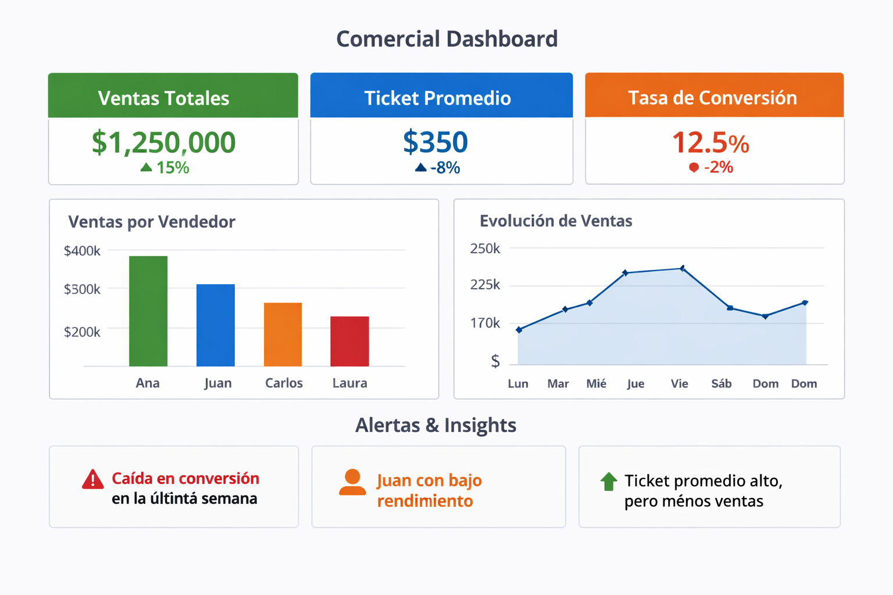

# 📊 Commercial Dashboard Strategy

Diseño de dashboard estratégico para equipos comerciales, enfocado en la toma de decisiones y seguimiento de performance.

---

## 🎯 Objetivo

Brindar visibilidad clara y accionable sobre el desempeño comercial para mejorar la toma de decisiones.

---

## 🧩 Problema

Los equipos comerciales suelen tener:

* Datos dispersos
* Falta de métricas claras
* Dificultad para detectar desvíos
* Decisiones tardías

---

## 💡 Solución

Diseño de un dashboard que centraliza información clave y permite:

* Monitorear performance en tiempo real
* Detectar oportunidades y problemas
* Priorizar acciones comerciales

---

## 📈 KPIs definidos

* Ventas totales
* Ventas por vendedor
* Tasa de conversión
* Ticket promedio
* Evolución temporal de ventas

---

## 🧠 Enfoque de diseño

El dashboard está pensado para:

* Simplicidad visual
* Enfoque en decisiones (no solo datos)
* Lectura rápida por parte de líderes

---

## ⚙️ Estructura del dashboard

1. Vista general (KPIs principales)
2. Análisis por vendedor
3. Evolución temporal
4. Identificación de desvíos

---

## 🖼️ Vista del dashboard

---

## 🚨 Ejemplos de insights

* 🔻 Caída en conversión en los últimos 7 días → revisar proceso comercial
* ⚠️ Vendedor con bajo rendimiento → oportunidad de coaching
* 📈 Ticket promedio alto pero menor volumen → posible problema de adquisición

---

## 🛠️ Herramientas

* Google Sheets
* Looker Studio / QuickSight
* SQL (opcional)

---

## 📊 Impacto esperado

* ✔️ Mejora en la toma de decisiones
* ✔️ Mayor visibilidad del negocio
* ✔️ Identificación rápida de problemas
* ✔️ Alineación del equipo comercial

---

## 📏 Métricas de éxito

* Frecuencia de uso del dashboard
* Tiempo de toma de decisiones
* Mejora en performance comercial

---

## 👩‍💼 Rol del equipo de datos

El equipo de datos no solo construye dashboards, sino que:

* Define métricas alineadas al negocio
* Acompaña la toma de decisiones
* Detecta oportunidades de mejora

---

## 🚧 Próximos pasos

* Automatización de datos
* Integración con CRM
* Alertas inteligentes
